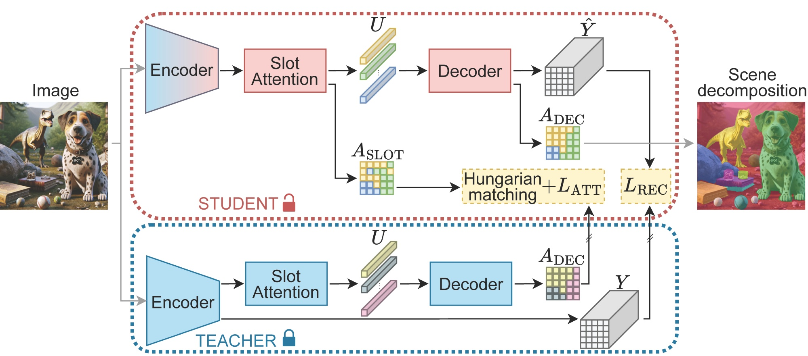

## SPOT: Self-Training with Patch-Order Permutation for Object-Centric Learning with Autoregressive Transformers

---

PyTorch implementation for SPOT.

<div align="center">
  
</div>


## COCO
#### Training

Train **SPOT (STAGE-1)** with a ViT-base/16 for **50 epochs** on COCO:

```bash 
python train_spot.py --dataset coco --data_path /path/to/COCO2017 --epochs 50 --num_slots 7 --train_permutations random --eval_permutations standard --log_path /path/to/logs/spot_teacher_coco
```

Train **SPOT (STAGE-2)** with a ViT-base/16 for **50 epochs** on COCO:

```bash 
python train_spot_2.py --dataset coco --data_path /path/to/COCO2017 --epochs 50 --num_slots 7 --train_permutations random --eval_permutations standard --teacher_train_permutations random --teacher_eval_permutations random --teacher_checkpoint_path /path/to/logs/spot_teacher_coco/TIMESTAMP/checkpoint.pt.tar --log_path /path/to/logs/spot_coco
```

---
Train **SPOT w/o self-training & w/o sequence permutation** with a ViT-base/16 for **100 epochs** on COCO:

```bash   
python train_spot.py --dataset coco --data_path /path/to/COCO2017 --epochs 100 --num_slots 7 --train_permutations standard --log_path /path/to/logs/spot_wost_wosq_coco
```

#### Evaluation

Evaluate **SPOT** with a ViT-base/16 on COCO aggregating all sequence permutations:

```bash 
python eval_spot.py --dataset coco --data_path /path/to/COCO2017 --num_slots 7 --eval_permutations all --checkpoint_path /path/to/logs/spot_coco/TIMESTAMP/checkpoint.pt.tar
```

## PASCAL VOC 2012

Train **DINOSAUR** with a ViT-base/16 for **280 epochs** on VOC:

```bash
CUDA_VISIBLE_DEVICES=0 python train_spot.py --dataset voc --data_path /mnt/data/gkako/VOC2012 --epochs 280 --num_heads 6 --num_slots 6 --log_path /mnt/datalv/gkako/spot_runs/seed_0/dinosaur_voc_280ep --train_permutations standard --seed 0
```

Train **SPOT S1** with a ViT-base/16 for **280 epochs** on VOC:

```bash 
CUDA_VISIBLE_DEVICES=0 python train_spot.py --dataset voc --data_path /mnt/data/gkako/VOC2012 --epochs 280 --num_heads 6 --num_slots 6 --log_path /mnt/datalv/gkako/spot_runs/seed_0/spot_1_voc_280ep --train_permutations random --eval_permutations standard --seed 0
```

Eval **DINOSAUR** with a ViT-base/16 for **560 epochs** on VOC:

```bash
CUDA_VISIBLE_DEVICES=0 python eval_spot.py --dataset voc --data_path /mnt/data/gkako/VOC2012 --num_heads 6 --num_slots 6 --checkpoint_path /mnt/datalv/gkako/spot_runs/seed_0/dinosaur_voc_560ep/2023-11-01T20\:27\:01.845591/checkpoint.pt.tar --seed 0 --use_second_encoder False --train_permutations standard --eval_permutations standard
```

#### MOVi-C

Train **SPOT S1** with a ViT-base/16 for **65 epochs** on MOVi-C:

```bash 
CUDA_VISIBLE_DEVICES=0 python train_spot.py --dataset movi --data_path /mnt/datalv/gkako/more_datasets/MOVi/c --epochs 65 --num_heads 6 --num_slots 11 --log_path /mnt/datalv/gkako/spot_runs/seed_0/spot_1_movic_65ep_simcoco_00002lr_000004lrmin --train_permutations random --eval_permutations standard --val_mask_size 128 --seed 0 --lr_main 0.0002 --lr_min 0.00004
```

Train **SPOT S2** with a ViT-base/16 for **65 epochs** on MOVi-C:

```bash 
CUDA_VISIBLE_DEVICES=0 python train_spot_2.py --dataset movi --data_path /mnt/datalv/gkako/more_datasets/MOVi/c --epochs 65 --num_heads 6 --num_slots 11 --log_path /mnt/datalv/gkako/spot_runs/seed_0/spot_2_movic_65ep_simcoco_00002lr_000004lrmin_00005ce_03clp --truncate bi-level --init_method embedding --ce_weight 0.005 --finetune_blocks_after 8 --train_permutations random --eval_permutations standard --teacher_train_permutations random --teacher_eval_permutations random --teacher_checkpoint_path /mnt/datalv/gkako/spot_runs/seed_0/spot_1_movic_65ep_simcoco_00002lr_000004lrmin/2023-11-07T22\:51\:31.491843/checkpoint.pt.tar --seed 0 --clip 0.3 --val_mask_size 128 --lr_main 0.0002 --lr_min 0.00004 --predefined_movi_json_paths train_movi_paths.json
```

Eval **DINOSAUR** with a ViT-base/16 for **65 epochs** on MOVi-C:
```bash 
CUDA_VISIBLE_DEVICES=2 python eval_spot.py --dataset movi --data_path /mnt/datalv/gkako/more_datasets/MOVi/c --num_heads 6 --num_slots 11 --checkpoint_path /mnt/datalv/gkako/spot_runs/seed_0/dinosaur_movic_65ep_simcoco_00002lr_000004lrmin/2023-11-07T18\:33\:53.649389/checkpoint.pt.tar --seed 0 --use_second_encoder False --train_permutations standard --eval_permutations standard --val_mask_size 128
```
